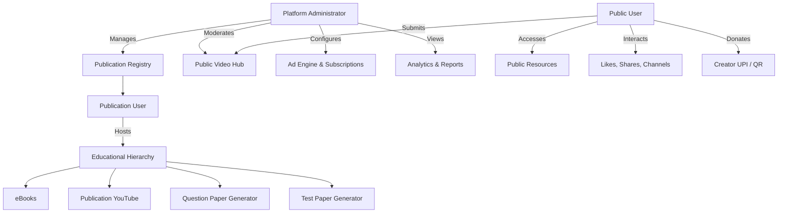
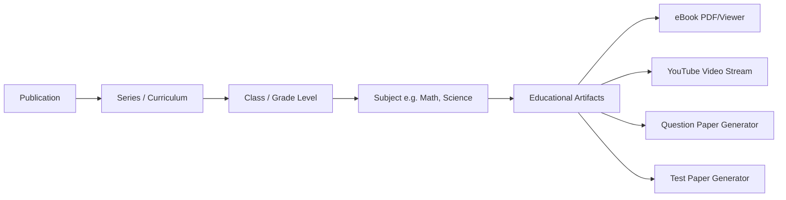
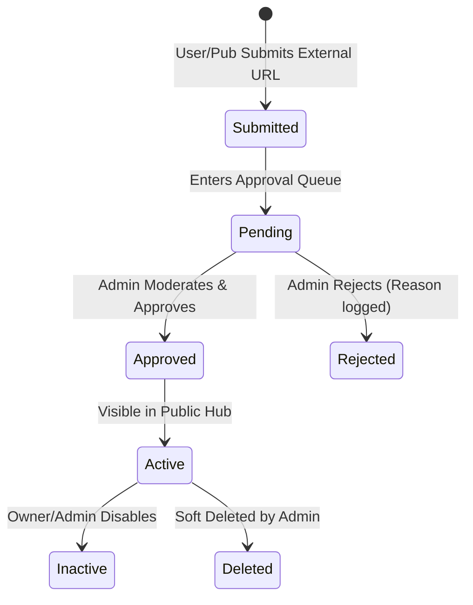

# Publication, Education & Video Content Platform
## Master Project Requirements Document (PRD)

---

## 1. Executive Summary & Overview

The **Publication, Education & Video Content Platform** is a multi-tenant digital ecosystem designed to serve educational publications, content creators, students, educators, and the general public.

### Primary Objectives
- **Multi-Tenant Publication Management**: Enable registered publications to host, organize, and distribute publication-specific educational resources (eBooks, categorized YouTube videos, Question Paper Generators, and Test Paper Generators).
- **Public Educational & Media Hub**: Provide public users access to generalized educational content and external video submissions (YouTube, Instagram, Facebook).
- **Advertisement & Monetization Engine**: Allow publications to purchase tiered advertisement packages (Silver, Bronze, Gold, Diamond) with dynamic admin-managed ad injection policies.
- **Direct Creator Support (Donation System)**: Enable viewers to directly tip/donate to video creators via integrated UPI IDs and QR codes without intermediate platform revenue deduction.
- **Centralized Administration & Moderation**: Grant platform administrators end-to-end control over publication onboarding, content moderation, ad placements, transaction auditing, and analytics.

---

## 2. System Architecture & High-Level Design

### Core Architecture Principles
1. **Strict Multi-Tenancy**: Logical isolation of publication-owned assets while maintaining shared platform infrastructure.
2. **Decoupled Social Integrations**: Embed and link external media (YouTube, Instagram, Facebook) without reinventing hosting or violating platform terms.
3. **Dynamic Ad Rule Engine**: Configurable ad injection (popups, pre-roll/mid-roll triggers, priority queues) maintained via admin interface without code deployment.
4. **Modular Extensibility**: Microservice/modular monolith readiness for future AI expansion (AI question generation, mobile apps, digital certificates).

---

## 3. User Categories & Access Control (RBAC)

| Feature / Access Area | Administrator | Publication User | Public User |
| :--- | :---: | :---: | :---: |
| **System Dashboard & Global Analytics** | Full | Publication-Scoped | General Personal |
| **Publication Management (CRUD)** | Full | Read Only (Own Details) | None |
| **Publication Content (eBooks, Generators)** | Full (All) | Scoped to Publication | Public Series Only |
| **Public Video Hub Submissions** | Full Moderation | Can Submit | Can Submit |
| **Ad Subscription Purchase** | Configuration | Can Purchase | None |
| **Direct Creator Donations** | Audit Log | Receive / View | Donate |
| **Reports & Financial Settlement** | System-Wide | Publication-Wide | Personal Activity |

---

## 4. Content Hierarchy & Taxonomy

All educational content adheres to a strict multi-level taxonomy:

$$\text{Publication} \longrightarrow \text{Series} \longrightarrow \text{Class} \longrightarrow \text{Subject} \longrightarrow \text{Educational Artifact}$$

### Taxonomy Example
- **Publication**: *Oxford University Press* / *ABC Publications*
- **Series**: *CBSE Board Curriculum 2026*
- **Class**: *Class 10*
- **Subject**: *Mathematics*
- **Artifacts**: Chapter 1 eBook PDF, Chapter 1 Lecture Link, Exercise Question Generator, Model Test Paper Generator.

---

## 5. Detailed Module Specifications

### 5.1 Authentication & Role Management
- **Auth Protocols**: JWT-based session management, OAuth2 integration (Google, Facebook logins).
- **Role Switching / Context Switching**: Automatic dashboard skinning upon login:
  - *Publication User*: Custom publication branding logo displayed, restricted data views.
  - *Public User*: Generic platform branding, unrestricted access to open series.
  - *Admin User*: Comprehensive administrative console.

---

### 5.2 Publication Management Module (Admin)
- **Publication Registration Fields**:
  - Publication Name, Legal Entity Name
  - Official Email, Mobile Contact, Business Address
  - Logo Image (PNG/SVG, auto-resizing)
  - Tax & Registration Identifiers
- **Operational Controls**: Add, Edit, Suspend/Deactivate, Delete, Re-activate.
- **Branding Dynamic Injection**: Dynamically inject publication assets into header, eBook cover headers, and generated paper watermarks.

---

### 5.3 Educational Content Modules

#### A. eBook Management
- **Storage & Rendering**: Secure cloud storage (AWS S3 / GCP Bucket) with watermarked HTML5/PDF Canvas viewer.
- **Fields**: Series, Class, Subject, Title, eBook Cover URL, Document URL, Active Status.

#### B. Publication YouTube Mapping
- **Embedding**: Embedded responsive iFrame players with native fallback links.
- **Hierarchy Mapping**: Mapped directly to Series $\rightarrow$ Class $\rightarrow$ Subject.

#### C. Question Paper Generator
- **Engine**: Dynamic engine parsing structured question banks (uploaded via Excel/CSV by Admin/Publication).
- **Features**: Chapter selection, difficulty distribution (Easy, Medium, Hard), total marks customization, PDF output generation with publication branding header.

#### D. Test Paper Generator
- **Engine**: Automated model test sheet compiler based on preset blueprint patterns.
- **Features**: Time limit allocation, answer key generation option, print-ready layout export.

---

### 5.4 Public Hub & Video Moderation Workflow

#### Video Submission Schema
- **Video URL** (YouTube / Instagram / Facebook URL regex validation)
- **Channel / Creator Name**
- **Category** (Educational, Informative, Religious, Entertainment, Technology)
- **Tags & Keywords**
- **Submitted By User ID & Timestamp**
- **Status**: `Pending`, `Approved`, `Rejected`, `Inactive`, `Deleted`

---

### 5.5 Video Interaction & Social Features
- **User Activity Dashboard**:
  - **Liked Videos**: Personal bookmarks of liked platform videos.
  - **Subscribed Channels**: Quick links to followed content channels.
  - **Shared Videos**: Tracking external social share actions.
  - **Recently Viewed**: History of viewed platform links.
- **Redirect Model**: Outbound interaction buttons (e.g., "Watch on YouTube", "Subscribe on Channel") redirect users directly to original social platform handlers when API restrictions apply.

---

### 5.6 Advertisement & Subscription Engine

#### Subscription Tiers for Publications

| Package Tier | Ad Limits | Display Priority | Video Placement Allocation | Duration |
| :--- | :--- | :--- | :--- | :--- |
| **Initial / Free** | Basic Banner | Low | 1 Video / Category | 30 Days |
| **Silver** | Medium Banner + Sidebar | Standard | Up to 10 Videos | 90 Days |
| **Bronze** | High Visibility Banner | High | Up to 25 Videos | 180 Days |
| **Gold** | Video Mid-Rolls + Banners | Very High | Up to 50 Videos | 365 Days |
| **Diamond** | Premium Popups + Top Priority | Max / Featured | Unlimited | Custom |

#### Dynamic Ad Rules (Configurable by Admin)
- **Popup Overlay Controls**: Frequency capping per user session.
- **Pre-Roll / Post-Roll Timer Controls**: Configurable skip delays (e.g., 5s mandatory view).
- **Targeting**: Publication-wise, Category-wise, and Subject-wise ad placements.

---

### 5.7 Payment Gateway & Transaction Processing
- **Gateway Integration**: Multi-gateway support (Razorpay, Cashfree, Stripe).
- **Transaction Log Record**:
  - `Transaction ID`, `Order Reference`
  - `Publication / User ID`
  - `Subscription Package ID`
  - `Amount`, `Currency`, `Tax Split (GST/VAT)`
  - `Payment Date & Expiry Date`
  - `Status` (`Pending`, `Successful`, `Failed`, `Refunded`)

---

### 5.8 Creator Donation System
- **Direct P2P Model**: Viewers directly support creators without platform intermediary commission.
- **Display Components**:
  - Creator UPI ID (e.g., `creator@upi`)
  - Dynamic / Static UPI QR Code rendering
  - One-click mobile UPI intent launcher (`upi://pay?...`)
- **Compliance & Disclaimer**: Explicit legal disclaimers informing users that donations are direct peer-to-peer transfers.

---

### 5.9 Reports & Analytics Module

#### 1. Channel Performance Reports
- Channel Name, Category, Associated Publication
- Total Subscribers, Total Views, Likes, Shares
- Ranking / Leaderboard based on subscriber growth

#### 2. System Financial & Operational Reports
- Publication-wise content asset audit
- Subscriptions revenue breakdown by tier
- Ad impression & CTR analytics
- Video moderation queue throughput (Approved vs. Rejected)

---

## 6. Technical Stack Recommendations

- **Frontend**: React / Next.js (TypeScript) + Vanilla CSS Design Tokens (Custom Glassmorphism Theme)
- **Backend API**: Node.js (NestJS / Express) or Python FastAPI
- **Database**: PostgreSQL (Relational multi-tenancy with row-level security) + Redis (Session & Ad Rule Caching)
- **Storage**: AWS S3 or Cloudflare R2 for eBooks and Thumbnails
- **Document Processing**: PDFKit / Puppeteer for dynamic Question & Test Paper PDF generation

---

## 7. Future Expansion Roadmap

1. **AI Question & Test Generation**: Automated extraction of questions from uploaded textbook PDFs using LLMs.
2. **Mobile Native Apps**: React Native / Flutter apps for iOS & Android with offline eBook reader support.
3. **Role Expansion**: Dedicated accounts for Teachers, Students, Schools, and Content Creators.
4. **Digital Certification & Online Exam Portal**: Proctored online tests with automated scoring and blockchain/verifiable digital certificates.
