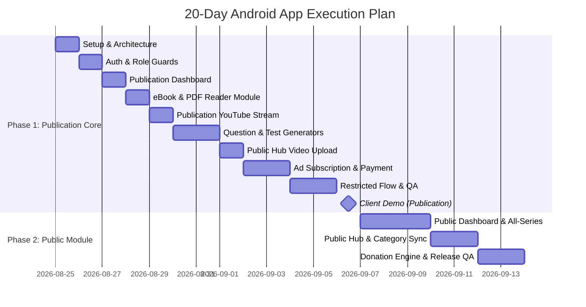

# Publication, Education & Video Content Platform — Android App
## Full Technical Evaluation, Architecture Skeleton & 20-Day Execution Plan

> **Handoff Document**: Designed for technical implementation, AI agent scaffold generation, and project management execution.

---

## 1. Tech Stack Evaluation & Decision Matrix

### 1.1 Comparison Matrix

| Criteria | Flutter (Dart) 🎯 | Native Kotlin (Compose) | React Native |
| :--- | :--- | :--- | :--- |
| **Cross-platform (Android + future iOS)** | ✅ Single codebase | ❌ Android-only | ✅ Single codebase |
| **Video Embed Support (YT / Insta / FB)** | ✅ Mature (`youtube_player_flutter`, `webview_flutter`) | ✅ Native (High Boilerplate) | ⚠️ Less mature for mixed video |
| **Offline PDF Reader & Downloading** | ✅ `syncfusion_flutter_pdfviewer` | ✅ Native PDF Renderer | ⚠️ Bridge overhead |
| **Payment Gateway (Razorpay / UPI)** | ✅ Official SDK wrappers | ✅ Native SDK | ⚠️ Community wrapper |
| **Background Download Manager** | ✅ `dio` + `workmanager` | ✅ Native WorkManager | ⚠️ Complex native bridges |
| **Dev Speed (3 Roles, 20+ Modules)** | ✅ High (Hot reload, declarative UI) | ❌ Slowest | ✅ High |
| **Performance (Video & Document heavy)** | ✅ High (Impeller / Skia rendering engine) | ✅ Native maximum | ⚠️ JS Bridge bottlenecks |

**Final Verdict**: **Flutter (Dart)** is selected due to cross-platform compatibility, mature PDF/Video package ecosystem, and optimal development velocity.

---

### 1.2 Risk Matrix & Technical Mitigations

| Identified Risk | Impact | Mitigation Strategy |
| :--- | :--- | :--- |
| **Social Video ToS Restrictions** | YouTube / Insta / FB forbid stream downloads | Scope offline features strictly to eBooks & Generated Papers (PDFs). Videos cache thumbnails & metadata only. |
| **Phased Business Model Shift** | Transition from free links to commission models | Build `SubscriptionService` & `PaymentService` behind an abstract contract, avoiding hardcoded flat-fee logic. |
| **Multi-Role Route Access Leaks** | Security / Data leakage across publications | Centralize role guards inside `GoRouter` redirect handler based on `AuthProvider` state. |
| **Subscription Payment Desynchronization** | False positive activation on failed payments | Implement double-verification server checks (`subscriptionStatus == active` **AND** `paymentStatus == successful`) before content unlock. |
| **App Deep-Linking Failures** | Instagram / FB redirection crashes | Use `url_launcher` + fallback to internal `WebView` if native social apps are not installed. |

---

## 2. Architecture Skeleton & Project Blueprint

### 2.1 Folder Architecture (`lib/`)

```
lib/
├── main.dart
├── core/
│   ├── constants/
│   │   └── app_constants.dart
│   ├── network/
│   │   ├── api_client.dart
│   │   └── api_endpoints.dart
│   ├── storage/
│   │   ├── local_storage_service.dart      // Hive/Isar offline storage
│   │   └── secure_storage_service.dart     // Encrypted tokens & keys
│   ├── routing/
│   │   └── app_router.dart                 // GoRouter with RBAC guards
│   └── theme/
│       └── app_theme.dart
├── models/
│   ├── user_model.dart
│   ├── publication_model.dart
│   ├── series_class_subject_model.dart
│   ├── ebook_model.dart
│   ├── video_model.dart
│   ├── category_model.dart
│   ├── subscription_model.dart
│   ├── payment_model.dart
│   └── donation_model.dart
├── providers/                              // Riverpod state management
│   ├── auth_provider.dart
│   ├── publication_provider.dart
│   ├── ebook_provider.dart
│   ├── video_provider.dart
│   ├── subscription_provider.dart
│   └── download_manager_provider.dart
├── services/
│   ├── auth_service.dart
│   ├── ebook_service.dart
│   ├── video_service.dart
│   ├── paper_generator_service.dart
│   ├── payment_service.dart
│   ├── donation_service.dart
│   └── download_manager_service.dart
├── screens/
│   ├── auth/
│   │   └── login_screen.dart
│   ├── dashboard/
│   │   └── dashboard_screen.dart           // Dynamic multi-role dashboard
│   ├── publication/
│   │   ├── ebook/ebook_hierarchy_screen.dart
│   │   ├── youtube/publication_youtube_screen.dart
│   │   ├── question_paper/question_paper_screen.dart
│   │   ├── test_paper/test_paper_screen.dart
│   │   ├── public_hub/upload_video_screen.dart
│   │   ├── public_hub/my_uploads_screen.dart
│   │   └── subscription/ad_subscription_screen.dart
│   ├── public/
│   │   ├── ebook/public_ebook_screen.dart
│   │   ├── youtube/public_youtube_screen.dart
│   │   └── public_hub/category_browse_screen.dart
│   └── shared/
│       ├── donation/donation_screen.dart
│       ├── video_player/video_player_screen.dart
│       ├── restricted_content_screen.dart   // Out-of-publication restriction
│       └── payment/payment_screen.dart
└── widgets/
    ├── hierarchy_picker.dart                // Series > Class > Subject Selector
    ├── category_chip_list.dart
    ├── video_card.dart
    ├── ebook_card.dart
    └── subscription_package_card.dart
```

---

### 2.2 Core Data Models Skeleton

#### User & Role Definitions
```dart
enum UserRole { publication, public, admin }

class UserModel {
  final String id;
  final String name;
  final String email;
  final UserRole role;
  final String? publicationId; // Nullable for public users

  UserModel({
    required this.id,
    required this.name,
    required this.email,
    required this.role,
    this.publicationId,
  });
}
```

#### Publication Metadata
```dart
class PublicationModel {
  final String id;
  final String name;
  final String email;
  final String mobile;
  final String address;
  final String logoUrl;
  final String inquiryNumber; // Shown on restriction screen
  final bool isActive;

  PublicationModel({
    required this.id,
    required this.name,
    required this.email,
    required this.mobile,
    required this.address,
    required this.logoUrl,
    required this.inquiryNumber,
    required this.isActive,
  });
}
```

#### Subscription & Payment Double-Verification
```dart
enum PackageTier { silver, bronze, gold, diamond }
enum SubscriptionStatus { active, inactive, expired, pendingUpgrade }

class SubscriptionModel {
  final String id;
  final String publicationId;
  final PackageTier package;
  final DateTime startDate;
  final DateTime endDate;
  final SubscriptionStatus status;
  final String paymentId; // Verified against PaymentModel

  SubscriptionModel({
    required this.id,
    required this.publicationId,
    required this.package,
    required this.startDate,
    required this.endDate,
    required this.status,
    required this.paymentId,
  });
}
```

#### Direct Creator Donation
```dart
class DonationModel {
  final String channelName;
  final String upiId;
  final String qrCodeUrl;
  final String creatorPhotoUrl; // Enhanced profile view

  DonationModel({
    required this.channelName,
    required this.upiId,
    required this.qrCodeUrl,
    required this.creatorPhotoUrl,
  });
}
```

---

### 2.3 Key Screen Skeleton: Access Restriction Handler

```dart
import 'package:flutter/material.dart';
import 'package:flutter_riverpod/flutter_riverpod.dart';

/// Displayed when a Publication user attempts to access resources outside their licensed publication.
class RestrictedContentScreen extends ConsumerWidget {
  const RestrictedContentScreen({super.key});

  @override
  Widget build(BuildContext context, WidgetRef ref) {
    // Access current publication details from Riverpod provider
    final publicationAsync = ref.watch(currentPublicationProvider);

    return publicationAsync.when(
      data: (pub) => Scaffold(
        body: Center(
          child: Padding(
            padding: const EdgeInsets.all(24.0),
            child: Column(
              mainAxisAlignment: MainAxisAlignment.center,
              children: [
                const Icon(Icons.lock_outline, size: 72, color: Colors.amber),
                const SizedBox(height: 16),
                const Text(
                  'Not Available in this Publication',
                  style: TextStyle(fontSize: 20, fontWeight: FontWeight.bold),
                ),
                const SizedBox(height: 8),
                const Text(
                  'Please contact your publication administrator for access.',
                  textAlign: TextAlign.center,
                ),
                const SizedBox(height: 16),
                ElevatedButton.icon(
                  onPressed: () {
                    // Launch phone dialer with inquiry number
                  },
                  icon: const Icon(Icons.phone),
                  label: Text('Inquiry: ${pub?.inquiryNumber ?? "N/A"}'),
                ),
              ],
            ),
          ),
        ),
      ),
      loading: () => const Center(child: CircularProgressIndicator()),
      error: (err, stack) => const Center(child: Text('Error loading details')),
    );
  }
}
```

---

## 3. 20-Day Execution Roadmap



### Day-by-Day Breakdown

| Day | Focus Area | Detailed Output |
| :--- | :--- | :--- |
| **Day 1** | Setup & Core Architecture | Repo setup, Flutter folder tree, Riverpod + GoRouter configuration, API client. |
| **Day 2** | Authentication & RBAC | Login screen, `AuthProvider`, role routing, publication logo dynamic switching. |
| **Day 3** | Publication Dashboard | Liked/Subscribed/Shared/Recommended video carousels & activity feeds. |
| **Day 4** | eBook Module | Series $\rightarrow$ Class $\rightarrow$ Subject picker, PDF rendering engine, local storage download manager. |
| **Day 5** | Publication YouTube | Mapped YouTube streams, custom responsive player with fullscreen handling. |
| **Day 6** | Question Paper Generator | Filter parameters, paper compiler, PDF print output generator. |
| **Day 7** | Test Paper Generator | Blueprint selection, model test compiler, solution key output. |
| **Day 8** | Video Upload Hub | Form validation (URL, category, tags, keywords), active/inactive submission tabs. |
| **Day 9** | Ad Packages & Payment | Package cards (Silver, Bronze, Gold, Diamond), Razorpay SDK integration, upgrade flow. |
| **Day 10** | Double-Verification Engine | Server payment cross-check (`Active status` + `Valid payment transaction ID`). |
| **Day 11** | Restricted Content Screen | Out-of-licensed publication handler (`RestrictedContentScreen`) with inquiry launcher. |
| **Day 12** | Publication QA & Polish | Integration testing, bug fixes, offline caching validation. |
| **Day 13** | **Client Demo #1** | **Live Demonstration of Completed Publication Module.** |
| **Day 14** | Public Dashboard | Platform-wide default logo, public activity feed. |
| **Day 15** | Public eBooks & YouTube | Public series picker, open-access eBook & video feeds. |
| **Day 16** | Public Paper Generators | Unrestricted public question & model test generators. |
| **Day 17** | Public Category Hub | Server-driven category chips, parental control toggles, external platform deep links. |
| **Day 18** | Social Interactions & Links | Like/Share/Save API hooks, YouTube direct-play, Insta/FB app launch resolver. |
| **Day 19** | Creator Donation Engine | Direct UPI & QR code display, creator profile card, intent dialer launcher. |
| **Day 20** | Final Testing & Build | Push notifications, regression test suite, production APK/AAB release build. |
